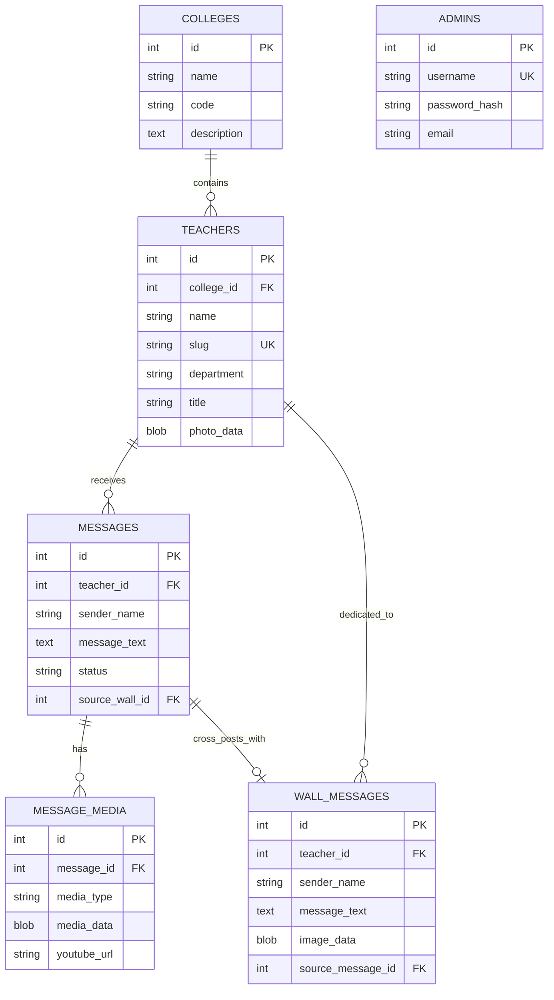

# ⚙️ Teacher's Day Tribute Platform — Backend API (`TD-Server`)

[](https://nodejs.org/)
[](https://expressjs.com/)
[](https://www.mysql.com/)
[](https://td-server-6azz.onrender.com)
[](https://teachersday2026.bscs4b.com)

A robust, secure, and production-ready RESTful API backend service powering the **Teacher's Day 2026** tribute portal. Built with **Node.js**, **Express**, and **MySQL**, this service handles tribute submissions, bi-directional cross-posting, streaming media storage, administrative moderation, and bulk faculty management.

- **Client Application**: [https://teachersday2026.bscs4b.com](https://teachersday2026.bscs4b.com)
- **Frontend Repository**: [marijuane23/TD](https://github.com/marijuane23/TD)

---

## 🌟 Architecture & Key Features

### 🔄 1. Bi-Directional Cross-Posting Engine

- **Timeline ➔ Open Wall Sync**:
  - When a student posts a tribute on an individual teacher's timeline, the system automatically replicates the message and photo to the public Open Wall (`wall_messages`).
  - Videos and YouTube embeds remain exclusive to the teacher's timeline to preserve 3D wall rendering performance.
  - Linked via `source_message_id` to prevent duplicate insertions and maintain relational lineage.
- **Open Wall ➔ Timeline Sync**:
  - When a student posts on the Open Wall and selects a dedicated teacher via the combobox, the tribute is automatically duplicated into that teacher's timeline (`messages`).
  - Linked via `source_wall_id`.

### 🗄️ 2. Direct Database Media Storage (`LONGBLOB`)

- Tribute photos and faculty profile pictures are securely stored as binary objects (`LONGBLOB`) directly in the MySQL database.
- **Zero Third-Party Storage Dependency**: Eliminates reliance on external cloud buckets (AWS S3, Cloudinary, etc.) that can expire or incur bandwidth charges.
- **Memory-Efficient Streaming**: Endpoints stream image buffers directly to client browsers with appropriate `Content-Type` and long-lived `Cache-Control` headers.

### 🖼️ 3. High-Performance Media Streaming Endpoints

- `GET /api/messages/media/:id`: Streams attached tribute photos.
- `GET /api/wall/:id/image`: Streams open wall tribute photos.
- `GET /api/teachers/:id/photo`: Streams faculty profile photos.
- Employs HTTP 304 Not Modified caching and `public, max-age=86400` browser caching.

### 🛡️ 4. Security & Moderation Pipeline

- **Automated Profanity Screening**: Submissions are scanned against an inappropriate keyword filter; flagged items are tagged with `status: pending` for manual review.
- **Express Rate Limiting**: Protects tribute endpoints against bot spam and abuse with IP-based window rate limits.
- **Reverse Proxy Trust**: Configured with `app.set('trust proxy', 1)` to seamlessly integrate with Render and Cloudflare reverse proxies without dropping client IPs.
- **JWT & Bcrypt**: Admin authentication utilizes salted bcrypt password hashes and signed JSON Web Tokens (JWT).
- **Strict CORS Control**: Dynamically parses comma-separated origins and regex domain patterns (`teachersday2026.bscs4b.com`, `localhost`).

### 📊 5. Bulk Faculty Operations (ExcelJS)

- Export complete faculty directories to `.xlsx` workbooks.
- Batch import new teachers with automatic department matching, validation, and error reporting.
- Generates downloadable pre-formatted Excel templates.

---

## 🛠️ Tech Stack & Dependencies

| Category                       | Package                                      | Purpose                                                             |
| ------------------------------ | -------------------------------------------- | ------------------------------------------------------------------- |
| **Runtime & Server**     | Node.js (ES Modules) + Express 4.21          | Asynchronous HTTP server and REST router                            |
| **Database Driver**      | `mysql2/promise` (v3.12)                   | High-performance MySQL client with connection pooling & SSL support |
| **File Uploads**         | `multer` (v2.4)                            | Memory storage for parsing multipart image uploads                  |
| **Authentication**       | `jsonwebtoken` + `bcryptjs`              | Stateless admin token authorization & password hashing              |
| **Security & Utilities** | `cors`, `dotenv`, `express-rate-limit` | Origin security, environment management, and anti-spam protection   |
| **Data Processing**      | `exceljs` (v4.4)                           | Excel workbook generation and parsing                               |

---

## 📁 Repository Structure

```
TD-Server/
├── backend/                           # Node.js backend root
│   ├── scripts/                       # Database management and migration scripts
│   │   ├── create-admin.js            # Seed/create administrator account
│   │   ├── generate-template.js       # Create sample Excel roster template
│   │   ├── migrate.js                 # Complete database schema creation
│   │   ├── migrate-wall-cross-post.js # Cross-posting columns migration & data backfill
│   │   ├── seed-teachers.js           # Populate initial faculty roster
│   │   ├── test-api.js                # Automated backend test suite
│   │   └── test-connection.js         # Validate MySQL connectivity and latency
│   ├── src/
│   │   ├── config/
│   │   │   ├── db.js                  # MySQL2 connection pool setup with keep-alive
│   │   │   └── env.js                 # Centralized environment variable validator
│   │   ├── controllers/               # HTTP request handlers
│   │   │   ├── admin.controller.js    # Faculty management, moderation, Excel import/export
│   │   │   ├── colleges.controller.js # Department / College list handlers
│   │   │   ├── messages.controller.js # Timeline tributes & media uploads
│   │   │   ├── teachers.controller.js # Faculty profiles & statistics
│   │   │   └── wall.controller.js     # Open Wall tribute feed & submissions
│   │   ├── db/                        # SQL schema scripts
│   │   │   └── schema.sql             # Relational table definitions and constraints
│   │   ├── middleware/                # Express middleware
│   │   │   ├── auth.js                # JWT verification for protected admin routes
│   │   │   ├── errorHandler.js        # Global error interceptor
│   │   │   └── upload.js              # Multer memory storage configuration
│   │   ├── models/                    # Data access layer & SQL queries
│   │   ├── routes/                    # API route declarations
│   │   │   ├── admin.routes.js        # /api/admin
│   │   │   ├── colleges.routes.js     # /api/colleges
│   │   │   ├── media.routes.js        # /api/messages/media
│   │   │   ├── messages.routes.js     # /api/messages
│   │   │   ├── teachers.routes.js     # /api/teachers
│   │   │   └── wall.routes.js         # /api/wall
│   │   ├── services/                  # Business logic (moderation, cross-post sync, excel)
│   │   ├── utils/                     # Helper functions (slugs, formatting)
│   │   ├── app.js                     # Express application definition & middleware
│   │   └── server.js                  # Server entry point & listener
│   ├── templates/                     # Static spreadsheet templates
│   ├── .env                           # Local environment variables
│   ├── .env.example                   # Environment variable template
│   └── package.json                   # Backend scripts and dependencies
├── RENDER_DEPLOYMENT_GUIDE.md         # Step-by-step Render cloud deployment guide
├── render.yaml                        # Infrastructure-as-code Blueprint for Render
└── README.md                          # This documentation file
```

---

## 🗄️ Database Architecture

The application uses a relational schema designed for fast queries and integrity:



---

## 📡 API Endpoints Reference

### Public Endpoints

| Method   | Endpoint                         | Description                                                                    |
| -------- | -------------------------------- | ------------------------------------------------------------------------------ |
| `GET`  | `/health`                      | Health check (returns database status and uptime)                              |
| `GET`  | `/api/colleges`                | Get all colleges and their department listings                                 |
| `GET`  | `/api/teachers`                | Get faculty list (supports`?college_id=` and `?search=`)                   |
| `GET`  | `/api/teachers/:slug`          | Get specific teacher profile, statistics, and bio                              |
| `GET`  | `/api/teachers/:id/photo`      | Stream teacher profile photo                                                   |
| `GET`  | `/api/teachers/:slug/messages` | Get approved tributes for a specific teacher's timeline                        |
| `POST` | `/api/teachers/:slug/messages` | Submit a new tribute (supports text, photo, and YouTube URL)                   |
| `GET`  | `/api/messages/media/:id`      | Stream attached tribute photo                                                  |
| `GET`  | `/api/wall`                    | Get approved tributes for the 3D Open Wall                                     |
| `POST` | `/api/wall`                    | Submit Open Wall tribute (supports photo and optional dedicated`teacher_id`) |
| `GET`  | `/api/wall/:id/image`          | Stream Open Wall tribute photo                                                 |

### Admin Endpoints (Protected by JWT)

| Method     | Endpoint                           | Description                                                      |
| ---------- | ---------------------------------- | ---------------------------------------------------------------- |
| `POST`   | `/api/admin/login`               | Authenticate admin credentials and receive JWT                   |
| `GET`    | `/api/admin/messages`            | Moderation queue (filter by`status=pending/approved/rejected`) |
| `PATCH`  | `/api/admin/messages/:id/status` | Update tribute moderation status                                 |
| `DELETE` | `/api/admin/messages/:id`        | Permanently delete inappropriate tribute                         |
| `POST`   | `/api/admin/teachers`            | Create new faculty profile                                       |
| `PUT`    | `/api/admin/teachers/:id`        | Update existing faculty profile                                  |
| `DELETE` | `/api/admin/teachers/:id`        | Archive / soft-delete faculty profile                            |
| `GET`    | `/api/admin/teachers/export`     | Download faculty directory as an Excel spreadsheet               |
| `POST`   | `/api/admin/teachers/import`     | Upload Excel spreadsheet to batch-import faculty                 |

---

## ⚙️ Environment Variables

Configure the following variables in `backend/.env`:

| Variable               | Required  | Default         | Description                                                       |
| ---------------------- | --------- | --------------- | ----------------------------------------------------------------- |
| `PORT`               | Optional  | `5000`        | Port for the Express server to listen on                          |
| `NODE_ENV`           | Optional  | `development` | `development` or `production`                                 |
| `DB_HOST`            | Required* | `localhost`   | MySQL hostname or cloud IP address                                |
| `DB_PORT`            | Optional  | `3306`        | MySQL port                                                        |
| `DB_USER`            | Required* | —              | Database user                                                     |
| `DB_PASSWORD`        | Required* | —              | Database password                                                 |
| `DB_NAME`            | Required* | —              | Database schema name                                              |
| `DB_SSL`             | Optional  | `false`       | Set to`true` when connecting to remote cloud MySQL              |
| `DATABASE_URL`       | Optional  | —              | Combined connection string (alternative to separate`DB_*` vars) |
| `JWT_SECRET`         | Required  | —              | Secret key used to sign and verify admin authentication tokens    |
| `CORS_ORIGIN`        | Required  | —              | Comma-separated allowed frontend origins                          |
| `BACKEND_PUBLIC_URL` | Optional  | —              | Public base URL of this backend service                           |

---

## 🚀 Getting Started (Local Development)

### 1. Prerequisites

- **Node.js**: `v20.x` or higher
- **MySQL**: `v8.0` running locally or accessible via remote cloud host

### 2. Installation

Navigate into the `backend` directory and install dependencies:

```bash
cd backend
npm install
```

### 3. Configure `.env`

Create a `.env` file in `backend/`:

```env
PORT=5000
NODE_ENV=development
DB_HOST=localhost
DB_PORT=3306
DB_USER=root
DB_PASSWORD=your_password
DB_NAME=teachers_day
DB_SSL=false
JWT_SECRET=super_secret_development_key
CORS_ORIGIN=http://localhost:5173
```

### 4. Run Database Setup & Migrations

```bash
# Test connection to MySQL
npm run db:test

# Run full schema creation
npm run db:migrate

# Apply cross-posting migration & backfill
node scripts/migrate-wall-cross-post.js

# Seed initial admin account
npm run db:seed-admin

# Seed sample faculty data
npm run db:seed-teachers
```

### 5. Start the Server

```bash
# Development mode with auto-reload:
npm run dev

# Production mode:
npm start
```

Verify the server is running by opening `http://localhost:5000/health`.

---

## ☁️ Production Deployment on Render.com

The backend is configured for deployment on **Render Web Services**:

1. **Root Directory**: `backend`
2. **Environment**: `Node`
3. **Build Command**: `npm install`
4. **Start Command**: `npm start`
5. **Environment Variables on Render**:
   - `NODE_ENV`: `production`
   - `DB_HOST`: Hostinger remote MySQL IP / hostname
   - `DB_USER`: Database username
   - `DB_PASSWORD`: Database password
   - `DB_NAME`: Database name
   - `DB_SSL`: `true` (or `false` based on provider configuration)
   - `JWT_SECRET`: High-entropy production key
   - `CORS_ORIGIN`: `https://teachersday2026.bscs4b.com,http://localhost:5173`

For detailed guidance, see [`RENDER_DEPLOYMENT_GUIDE.md`](./RENDER_DEPLOYMENT_GUIDE.md) and [`render.yaml`](./render.yaml).

---

## 🔗 Related Repositories

- **Frontend Client Application**: [marijuane23/TD](https://github.com/marijuane23/TD)
- **Live Client Application**: [teachersday2026.bscs4b.com](https://teachersday2026.bscs4b.com)

---

## 📄 License

Created for the **Teacher's Day 2026** celebration by BSCS 4B. All rights reserved.
